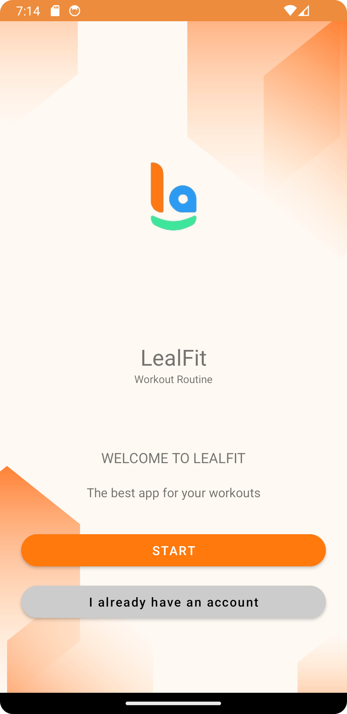
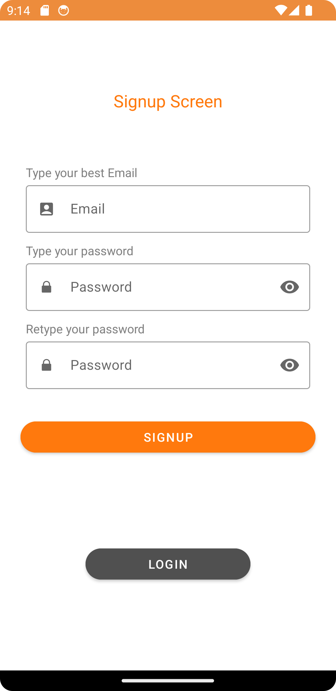
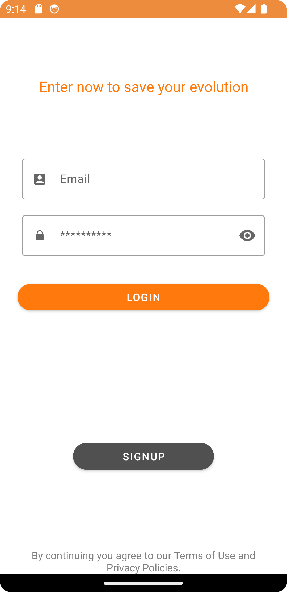
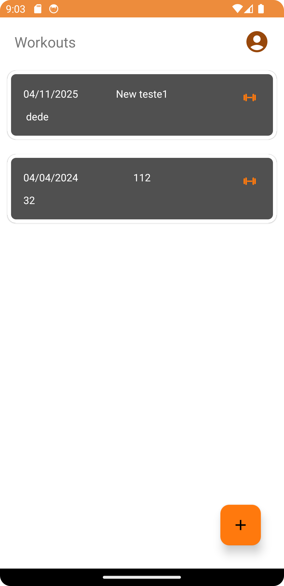
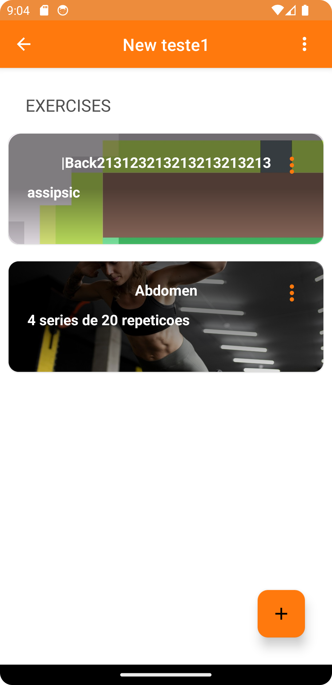
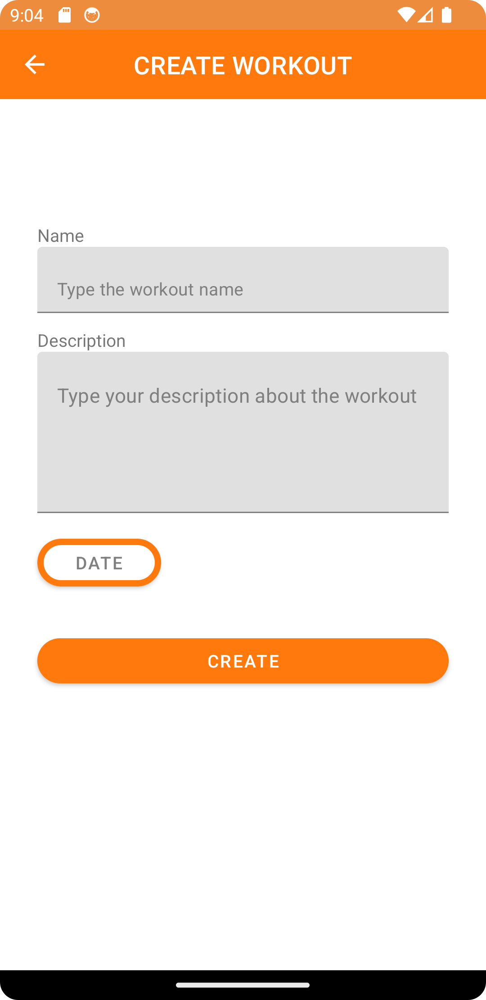
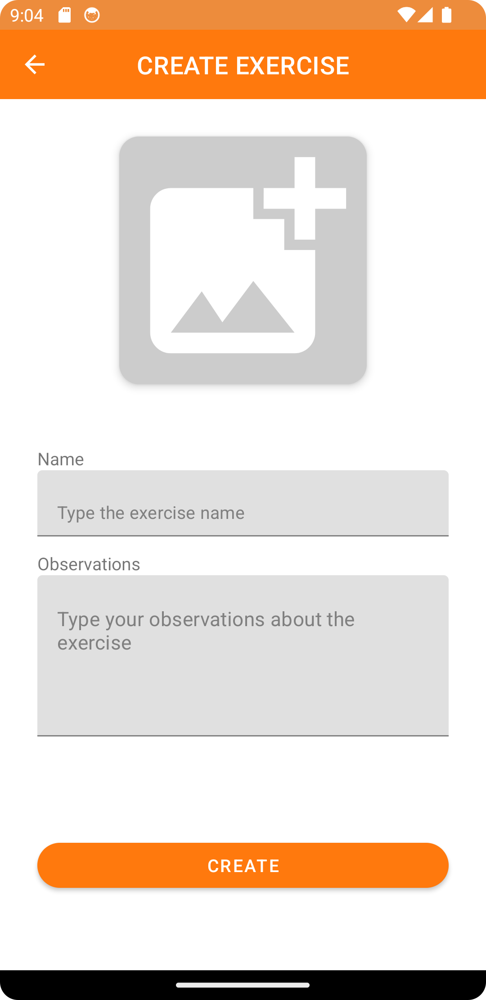

LealFit
=============================
    
   

Features
=============================
*  Registro e Login para usar o aplicativo
*  Criar, Atualizar, Deletar, e visualizar Treinos e exercicios programados para um rotina de Exercicios que voce determinar (Crud Completo)
*  Definir uma Imagem para Cada exercício

Libs
=============================
* * *
*  Usei Coroutines para lidar com tarefas assíncronas juntamente com o Flow, a quais sao totalmente compativeis, o uso do Flow foi escolhido por sua versatilidade e reatividade, o Flow foi usado nesse projeto para que os fragments possam observa-los e de acordo com o estado atual, a UI se comportar de acordo.

*  Usei Cloud FireStore para persistencia de dados via nuvem, com ele + Flow a Ui consegue reagir diretamente a uma mudanca no banco.

*  O Firebase Authentication simplifica significativamente o processo de registro e login de usuários. É uma solução conveniente, especialmente quando não há um sistema de autenticação personalizado. Com o Firebase, você pode implementar facilmente fluxos de autenticação seguros e confiáveis em seu aplicativo, sem a necessidade de configurar e gerenciar um backend próprio.

*  Firebase Storage para armazenamento das imagens via nuvem.

*  Navigation Component para simplificar a navegação entre fragments em um app, junto a ele usei safeargs para uma trasnferencia de dados entre fragments segura.

*  Dagger/Hilt para diminuição do Boilerplate, automatizando grande parte da geração de código necessária para injeção de dependência, o que facilita a configuração e o uso.

*  Glide para carregamento de imagem

*  Parcelable que permite a serialização e transporte eficiente de objetos entre componentes do aplicativo.
* * *

Arquitetura
=============================

Em meu projeto, adotei a arquitetura MVVM (Model-View-ViewModel) para separar a lógica de apresentação da lógica de negócios. A principal vantagem dessa abordagem é a capacidade de manter os dados na ViewModel. Isso garante que os dados permaneçam persistentes, independentemente do ciclo de vida do Fragment ou da Activity. Usei também Clean Architecture para desacoplar as camadas de um aplicativo para torná-lo mais sustentável, escalável e testável. __(OBS: implementei Clean Architecture por questao de ser apresentação de projeto, para deixar claro que sei, dependendo do contexto do app e do framework que estamos usando eu nao usaria, pois uma das finalidades principais dela é a proteção contra a obsolescência de frameworks)__.

